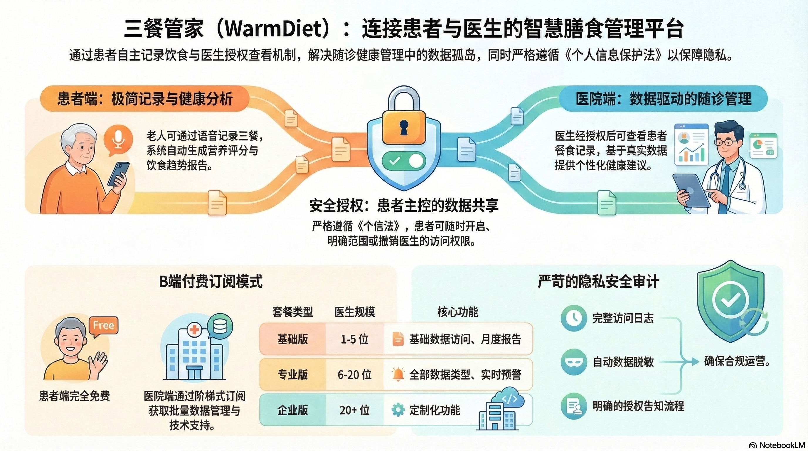

# 三餐管家 (WarmDiet Platform)

> 面向老年患者的医疗健康管理平台 —— 患者日常餐食记录 + 医生授权随诊管理。开源 open-core 版本。

<div align="center">
  
</div>

## 🌐 在线体验

平台已部署在 Cloudflare，可直接访问在线 Demo（内置测试数据，**任意密码即可登录**）：

| 入口 | 地址 | 说明 |
|------|------|------|
| 🏥 医院 / 医生端 | https://warmdiet-platform.xruns.dev/ | 工作台、患者管理、授权管理 |
| 👨‍👩‍👧 家属 / 患者端 H5 | https://warmdiet-platform.xruns.dev/family/ | 首页、餐食记录、健康报告、AI 咨询 |

> 在线 Demo 使用内置内存数据，不连接真实数据库，也不包含任何真实患者数据。刷新页面数据可能重置。

**Demo 测试账号**

| 角色 | 登录方式 | 账号 | 密码 |
|------|----------|------|------|
| 🏥 医院/医生 | 统一社会信用代码 | `91110000MD0010209` | 任意 |
| 👤 患者/家属 | 手机号 | `13700137000` | 任意 |

## 📋 项目简介

「三餐管家」帮助老年患者记录日常餐食，并根据《个人信息保护法》要求，通过**患者主动授权**机制，让主治医生在授权范围内安全查看患者数据，用于随诊健康管理。

本仓库是 **open-core 开源版**，聚焦可手动操作的产品面：医院端控制台、家属端 H5 手动补录、患者授权流程、基础健康报告与 Demo 后端。小爱/小智硬件语音链路、MCP bridge、AI 餐食识别、私有 prompt 与模型编排等属于闭源 Enterprise / AI Core 能力，不包含在本仓库中。开源边界详见 [OPEN_SOURCE_BOUNDARY.md](./OPEN_SOURCE_BOUNDARY.md)。

## 🎯 核心功能

### 患者 / 家属端（H5）
- 🍽️ **餐食记录** —— 手动记录早/午/晚餐，自动汇总营养
- 📊 **健康报告** —— 营养评分、饮食趋势分析
- 🗣️ **饮食对话日志** —— 记录饮食偏好与反馈
- 🔐 **医生授权管理** —— 患者明确授权/撤销医生查看数据
- ⚙️ **个人设置** —— 老人阅读模式、设备绑定、偏好配置

### 医院 / 医生端（Web 控制台）
- 👨‍⚕️ **患者数据访问** —— 在患者授权范围内查看餐食记录与报告
- 📈 **随诊健康管理** —— 基于数据给出健康建议
- 📋 **数据统计** —— 患者数据汇总分析
- 🔒 **访问审计** —— 授权与访问日志、权限管理

## 🛠️ 技术栈

| 层 | 技术 |
|----|------|
| 前端（医院端 / 家属端 H5） | React 19 · Vite 6 · TypeScript · Tailwind CSS 4 · Recharts |
| 后端（本地开发） | Express 4 · better-sqlite3 · JWT · Zod |
| 在线 Demo | Cloudflare Workers（内存 Demo API）+ Workers Assets（SPA 托管） |
| 可选自托管 | Docker · Kubernetes（阿里云 ACK 等） |

## 📁 项目结构

```
warmdiet-platform/
├── src/                    # 医院端前端（React + Vite）
│   ├── components/         #   授权管理、UI 组件
│   ├── App.tsx
│   └── main.tsx
├── family-h5/              # 家属 / 患者端 H5（独立 Vite 应用）
│   └── src/
├── server/                 # 本地开发后端（Express + SQLite）
│   ├── src/                #   controllers / services / config
│   ├── database/           #   schema.sql / seeds.sql
│   └── scripts/            #   init-seed.cjs
├── worker/                 # Cloudflare Worker（在线 Demo API）
│   └── index.ts
├── k8s/                    # Kubernetes 自托管清单
├── Dockerfile
├── docker-compose.yml
├── wrangler.jsonc          # Cloudflare 部署配置
├── vite.config.ts
└── README.md
```

## 🚀 本地开发

### 环境要求
- Node.js >= 18
- npm >= 9

### 安装与启动

```bash
npm install

# 一键启动：后端 + 医院端前端 + 家属端 H5
npm run dev:all
```

`npm run dev:all` 会自动释放端口并并行启动三个服务：

| 服务 | 地址 |
|------|------|
| 后端 API | http://localhost:4000 （健康检查 `/health`） |
| 医院端前端 | http://localhost:4001 |
| 家属端 H5 | http://localhost:4100 |

- 重启全部：再次运行 `npm run dev:all`（已内置杀端口，无需手动清理）
- 停止全部：`npm run kill-ports`

### 环境配置

前端只需一个变量，复制示例文件即可：

```bash
cp .env.local.example .env.local
```

```env
# 前端访问后端 API 的地址
VITE_API_URL=http://localhost:4000/api
```

> `.env.local`、`.env.*.local`、`*.db`、`k8s/secret.yaml`、`.dev.vars` 等均已在 `.gitignore` 中，**不会被提交**。请把所有真实密钥放在这些文件或部署平台的环境变量中，切勿写入仓库或提交到 git。

### 分别启动

```bash
npm run dev          # 仅医院端前端（4001）
npm run dev:server   # 仅后端（4000）
npm run dev:family   # 仅家属端 H5（4100）
```

### 本地测试登录

- **医院端**：统一社会信用代码 `91110000MD0010209`，密码 `password123`
- **家属端 H5**：优先用后端 Demo 接口获取测试患者 token：

  ```bash
  curl -X POST http://localhost:4000/api/demo/patient-token
  ```

  将返回的 `data` 写入浏览器 localStorage 的 `family_patient_token` 即可模拟登录。

### 构建

```bash
npm run build        # 构建医院端 + 家属端 H5 到 dist/
npm run lint         # 类型检查（tsc --noEmit）
```

---

## ☁️ 部署到 Cloudflare（在线 Demo 使用的方式）

在线 Demo（`warmdiet-platform.xruns.dev`）由 Cloudflare Workers 托管：`worker/index.ts` 提供内存 Demo API，前端构建产物作为 Workers Assets 以 SPA 方式托管。

```bash
# 本地预览（构建 + wrangler dev）
npm run preview

# 部署（构建 + wrangler deploy）
npm run deploy
```

配置见 [wrangler.jsonc](wrangler.jsonc)。Demo API 为无状态内存实现，仅用于体验流程，不做持久化。

---

## 🐳 自托管：Docker

```bash
mkdir -p data
docker-compose up -d          # 服务运行在 http://localhost:4000
docker-compose logs -f
docker-compose down
```

数据库文件 `warmdiet.db` 持久化到 `./data`。

| 环境变量 | 默认值 | 说明 |
|----------|--------|------|
| `PORT` | 4000 | 服务端口 |
| `NODE_ENV` | production | 运行环境 |
| `DATABASE_PATH` | /data/warmdiet.db | SQLite 数据库路径 |
| `JWT_SECRET` | *(务必在生产修改)* | JWT 密钥 |
| `GEMINI_API_KEY` | - | 可选，AI 功能 |

自托管方式下，浏览器访问 `http://localhost:4000` 即为统一登录入口。

---

## ☸️ 自托管：Kubernetes

`k8s/` 目录提供了一套部署清单（namespace / configmap / deployment / pvc / ingress / hpa）。

```bash
kubectl apply -f k8s/namespace.yaml
kubectl apply -f k8s/configmap.yaml
kubectl apply -f k8s/secret.yaml      # 需自行创建，包含 JWT_SECRET 等
kubectl apply -f k8s/deployment.yaml
kubectl apply -f k8s/pvc.yaml
kubectl apply -f k8s/ingress.yaml
kubectl apply -f k8s/hpa.yaml
```

> `k8s/secret.yaml` 不纳入版本库，请按 `configmap.yaml` 中引用的键自行创建，切勿提交任何真实密钥。

---

## 🔑 配置与密钥（自部署必读）

本项目**不在仓库内保存任何真实密钥**。所有敏感值都通过环境变量注入，请在你的部署环境（`.env.local`、Docker `-e`、K8s Secret、Cloudflare 环境变量等）中自行配置。

### 后端环境变量一览

| 变量 | 是否必需 | 默认值 | 说明 |
|------|:---:|------|------|
| `PORT` | 否 | `4000` | 后端服务端口 |
| `NODE_ENV` | 否 | `development` | 运行环境，生产请设为 `production` |
| `DATABASE_PATH` | 否 | `server/data/warmdiet.db` | SQLite 数据库文件路径；Docker 下建议 `/data/warmdiet.db` |
| `JWT_SECRET` | **生产必需** | 内置占位值 | JWT 签名密钥，**生产环境务必替换为随机强口令** |
| `JWT_EXPIRES_IN` | 否 | `7d` | Token 有效期 |
| `CORS_ORIGIN` | 否 | `*` | 允许的跨域来源，生产建议收敛为你的域名 |
| `SALT_ROUNDS` | 否 | `10` | bcrypt 加密强度 |
| `GEMINI_API_KEY` | 可选 | 空 | 启用 Gemini AI 能力时填写 |
| `OPENROUTER_API_KEY` | 可选 | 空 | 启用 OpenRouter（OCR/AI）时填写 |
| `OPENROUTER_BACKUP_API_KEY` | 可选 | 空 | OpenRouter 备用 Key |
| `OPENROUTER_APP_NAME` / `OPENROUTER_APP_URL` | 可选 | 见代码 | OpenRouter 应用标识 |
| `AI_CONSULTATION_API_BASE_URL` 等 | 可选 | 见代码 | AI 咨询对接参数，需接入你自己的服务 |
| `LOG_LEVEL` | 否 | `info` | 日志级别 |

> 完整定义见 [server/src/config/env.ts](server/src/config/env.ts)。未配置可选项时，对应功能会自动降级或关闭，不影响手动录入等基础流程。

### 生成一个安全的 `JWT_SECRET`

```bash
node -e "console.log(require('crypto').randomBytes(32).toString('hex'))"
```

### 各部署方式如何注入密钥

- **本地开发**：写入 `.env.local`（已被 `.gitignore` 忽略）
- **Docker**：`docker run -e JWT_SECRET=xxx -e GEMINI_API_KEY=xxx ...` 或写入 `docker-compose.yml` 的 `environment`
- **Kubernetes**：写入你自建的 `k8s/secret.yaml`（**该文件不纳入版本库**），由 `deployment.yaml` 引用
- **Cloudflare**：在线 Demo（`worker/index.ts`）为纯内存实现，**不需要任何密钥**；如接入真实后端，用 `wrangler secret put <KEY>` 配置

> ⚠️ 在线 Demo 登录接受任意密码、使用内存假数据，**仅供体验**。任何真实部署都必须设置强 `JWT_SECRET`、收敛 `CORS_ORIGIN`，并接入真实持久化数据库。

## 🔒 隐私与安全

本项目遵循《个人信息保护法》设计授权机制：

- ✅ **患者自主授权** —— 完全由患者决定授权给谁
- ✅ **明确告知范围** —— 授权前展示数据类型与时间范围
- ✅ **随时撤销** —— 患者可随时撤销，立即生效
- ✅ **访问审计** —— 记录每次医生访问
- ✅ **数据脱敏** —— 返回给医生的数据自动脱敏

在线 Demo 与仓库不含任何真实患者数据，所有账号与记录均为测试数据。

## 📚 文档

- [开源边界说明](./OPEN_SOURCE_BOUNDARY.md)

## 🤝 贡献

欢迎提交 Issue 和 Pull Request：

1. Fork 本仓库
2. 创建特性分支 `git checkout -b feature/AmazingFeature`
3. 提交更改 `git commit -m 'Add some AmazingFeature'`
4. 推送分支 `git push origin feature/AmazingFeature`
5. 开启 Pull Request

## 📄 许可证

[MIT License](./LICENSE)

---

**WarmDiet Team** © 2026
