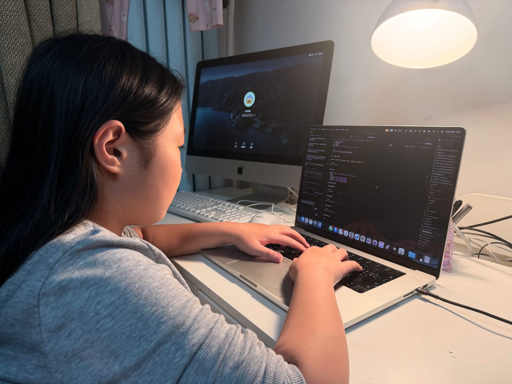

# 第三部分 项目原始资料
## ——我在制作这个项目过程中的一些资料照片

**项目名称：** 三餐管家  
**组别：** 小学高  
**项目类别：** 社会科学

> 本部分用于呈现项目的一手观察资料，按照“发现问题 → 形成方案 → 动手实现 → 产出成果”的顺序组织图片与解读，展示研究过程的真实性与完整性。

这一部分我用照片来讲清楚：这个项目不是凭空想出来的，而是从家里每天遇到的真实问题一步步做出来的。

---

## 一、发现问题：术后家庭照护中的真实困难

**（图1）**  
  
**图1解读：** 药很多、名字也复杂，第一眼真的看不懂，这让我意识到“先看懂药”是第一步。

**（图2）**  
  
**图2解读：** 分格药盒能提醒时间，但不能告诉我们“这样吃对不对”。

**（图3）**  
  
**图3解读：** 每周分药很认真，但也很费精力，还容易漏掉细节。

**（图4）**  
  
**图4解读：** 营养成分表信息太多，我们很难马上判断是不是适合术后饮食。

**（图5）**  
  
**图5解读：** 冰箱里食材不少，但“今天到底怎么搭配”还是拿不准。

**（图6）**  
  
**图6解读：** 做饭时问题会更具体，比如饺子馅会不会太油，这种问题特别常见。

**（图7）**  
  
**图7解读：** 厨房里忙起来，盐糖很容易放多，光靠记忆很难一直做对。

**（图8）**  
  
**图8解读：** “少糖少盐”听起来简单，但要每顿都做到，其实不容易。

**（图9）**  
  
**图9解读：** 像牛奶这种日常食物，也有“喝多少、什么时候喝”的问题。

---

## 二、形成方案：从生活痛点到产品构思

**（图10）**  
  
**图10解读：** 我把前面的麻烦都整理成三件事：能记录、能识别、能给建议。

---

## 三、动手实现：敢于上手，让 AI 替你干活

**（图11）**  
  
**图11解读：** 这是我参与调试和测试的过程。对我来说，做项目就是“发现问题后，真的去动手解决”。不要害怕没有编程经验，只要你用自然语言和 AI 对话，告诉你需要什么功能，AI 会帮助你一点点梳理清楚需求，逐步把你脑子里的画面一步步实现。

---

## 四、产出成果：应用界面与功能闭环展示

|  |  |
| :---: | :---: |
|  |  |
|  |  |
|  |  |
|  |  |
|  |  |
|  |  |

**展示解读：** 这些页面连起来后，已经能完整走通流程：先记录，再识别，最后给建议。也就是说，这个项目已经从“想法”变成了“能实际演示和继续改进的作品”。
