# 帮奶奶“管住嘴、记性好”
## ——我和爸爸开发的“三餐管家”：用AI帮奶奶管理术后饮食和吃药

**说明：** 文中图片已链接至 `docs/md` 文件夹内对应文件。顺序：图1=IMG_1534，图2=IMG_1539，图3=IMG_1540，图4=IMG_1557，图5=IMG_1562，图6-7=IMG_1564，图8=IMG_1567，图9=IMG_1568，图10=IMG_1573，图11-12=IMG_1545，图13-16=IMG_1548。

---

**作者：李思慧**  
**学校：** _____________（请填写）  
**年级：五年级**  
**辅导老师（爸爸）：李光**  
**完成时间：2025年12月**

---

## 一、 这个想法是怎么来的（摘要）

去年10月，我的奶奶做了胆囊切除手术。出院回家后，医生特意嘱咐要长期吃药，而且吃饭特别有讲究——不能吃油腻的（低脂），还要少盐少糖。

但我发现家里一下子乱套了：奶奶每天要把一大把药倒出来，药名谁都看不懂；爸爸妈妈每天做饭也发愁，不知道冰箱里的肉能不能吃，怕一不小心做错了让奶奶肚子疼。我就想：现在的AI这么聪明，能不能做一个“小管家”，让奶奶动动嘴就能记下吃了什么，我和爸爸用手机拍一下医嘱和药盒，系统就能告诉我们今天该给奶奶做什么饭？

在爸爸的帮助下，我当“产品经理”，爸爸当“程序员”，我们用三周时间调用了最新的AI大模型接口，做出了这个“三餐管家”的小程序雏形。

---

## 二、 我发现了什么麻烦

奶奶手术回家后，我拿着爸爸的手机拍了很多照片，发现生活里全是“小麻烦”。

**（图1）**  
  
**图1：** 奶奶的药袋子像个百宝箱，但里面的“天书”我完全看不懂。

奶奶每天要吃好几种药，她从大袋子里拿出来给我看，药盒上的字密密麻麻，什么“利胆片”“消炎药”，我和奶奶都要看半天才能分清哪个是饭前吃，哪个是饭后吃。

**（图2）**  
  
**图2：** 奶奶用早、中、晚分格的药盒，这样不容易忘吃药。

**（图3）**  
  
**图3：** 爸爸每周日晚上帮奶奶把下一周的药都分装进周用药盒里。但是药盒只能提醒“该吃药了”，提醒不了“吃得对不对”。医生说的“低脂饮食”到底是什么？药盒可不会说话。

**（图4）**  
  
**图4：** 我盯着买回来的菜，包装上的营养成分表像天书，奶奶一天该吃多少菜、多少盐和糖，我搞不清。

**（图5）**  
  
**图5：** 打开冰箱，猪肉、牛肉、鱼虾都有。医生说少吃油腻，那这些肉奶奶都能吃吗？该怎么吃、吃多少？爸爸每次做饭前都很犹豫，生怕做错了影响奶奶恢复。

**（图6、图7）**  
  
**图6、7：** 有天家里包饺子，猪肉大葱馅。这种饺子，奶奶胆囊不好能吃吗？

有天家里包饺子，我就问爸爸：“这个猪肉大葱馅的油多不多？奶奶吃了没事吗？”爸爸也愣住了，还得去网上查半天。我就想，要是有一个像Siri那么聪明的助手，直接告诉我们“这个饺子脂肪太多，建议奶奶只吃3个”多好啊。

**（图8、图9）**  
  
**图8：** 医生要求少盐少糖，但炒菜的时候手一抖就容易多放。  
  
**图9：** 做菜有时多多少少都会放糖，医生说少糖，怎么在每天生活里都记得住、做得到？

**（图10）**  
  
**图10：** 还有，牛奶奶奶能喝吗？喝多少？早上喝还是晚上喝？这些细节太折磨人了。

生活里这种小事太多了，医生当时的嘱咐我们不可能每句话都背下来。我就想：要是有个“大脑”能帮我们把医生的话都记住就好了。

---

## 三、 我的鬼点子

看着爸爸发愁，我突然想到了家里的智能音箱和豆包。

**（图11、图12）**  
  
**图11、12：** 我看着家里的小爱同学，心想：它能不能变聪明点，能不能把豆包装进去？帮奶奶解决吃药提醒、健康管理和一日三餐规划这些问题？

现在的AI都能写作文、画画了，既然它这么厉害，能不能让它专门“学习”奶奶的病历？我就跟爸爸说：“爸爸，我们能不能教会小爱同学，让奶奶只要对着他说话，小爱就记下来；我们把医嘱拍张照，小爱就自动学会怎么照顾奶奶？”

**（图13、图14、图15、图16）**  
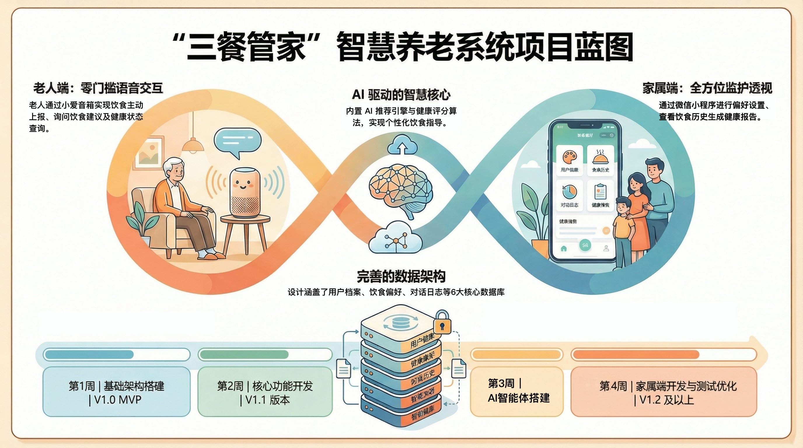  
**图13-16：** 我的构思图。

我和爸爸商量了一个计划：
1. **奶奶不会打字**：所以一定要能**听懂语音**。奶奶说“我吃了早饭”，系统要能听懂。
2. **方便爸爸录入**：所以一定要能**拍照识别**。医生写的纸、药盒上的字，拍一下就自动变成文字存进去。
3. **AI要会思考**：系统要根据医嘱，自动分析奶奶今天吃的对不对。并且分析建议下一餐吃什么，食物适不适合奶奶吃。

---

## 四、 我们是怎么做出来的

爸爸说我的想法很好，现在是 AI 时代了，人人都是产品经理，有了 AI 的辅助，编程序写代码已经不是专业人员独有的技能了，爸爸教我怎么利用大模型的编程能力，我只需要使用自然语言和大模型说话描述需求，写代码的事情交给模型去做，我要做的就是将自己想要的功能，可以清晰准确的描述给大模型，这样经过很多轮的沟通迭代，产品的第一代雏形就做出来了。

**1. 奶奶说话，AI自动记账**

以前要手写记录血压血糖，现在奶奶只要对着手机说：“小爱，我刚量了血压，128，76，早饭吃了一个煮鸡蛋。”
我们的程序就能自动把这些话变成数据，存到表格里。爸爸说这是用了**语音识别技术**。

**2. 拍照秒懂医嘱**

这是我觉得最神奇的地方！爸爸用手机拍了一下医生那张写得龙飞凤舞的病历，系统居然这能认出来上面写了“低脂休养，避免油炸”，并且自动把这些要求变成了奶奶的“饮食规则”。
以后再拍药盒，系统也能自动把药名记下来，不用爸爸一个字一个字敲进去了。

**3. AI帮爸爸规划菜单**

现在，爸爸每天打开我们的“三餐管家”，系统就会根据刚才拍进去的医嘱，建议道：“基于胆囊术后康复要求，今天午餐建议清蒸鱼，避免红烧肉。”
如果奶奶偷吃了一块红烧肉，系统还会温柔地提醒：“今天的脂肪摄入有点超标哦，晚饭建议喝点小米粥。”

**4. 谁在用？**

- **奶奶**：负责“说”。吃啥了、身体咋样，直接说就行。
- **爸爸**：负责“拍”和“看”。拍医嘱、拍药盒，然后看系统给的做饭建议。

### 5. S-Diet App 界面功能展示

这是我们最终做出来的“三餐管家”小程序界面：

|  |  |
| :---: | :---: |
| 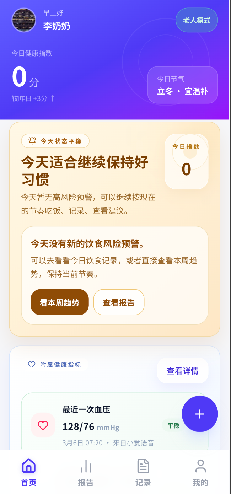 | 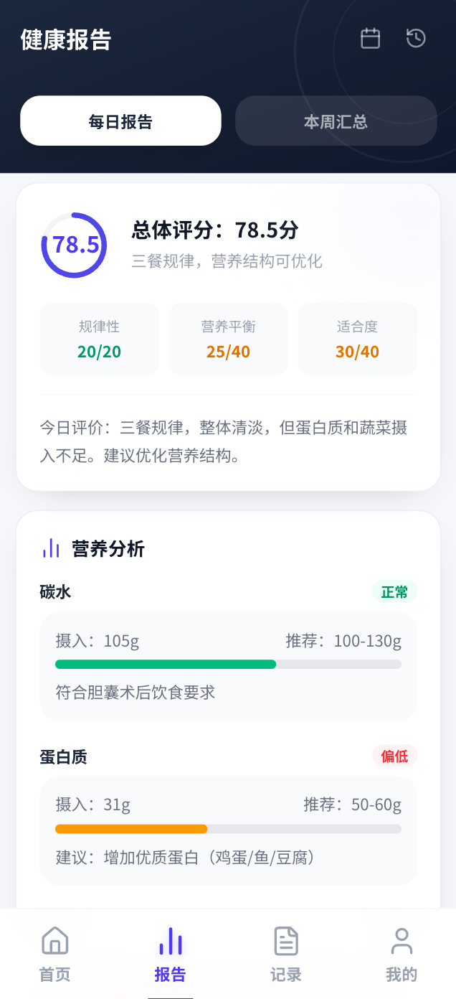 |
| 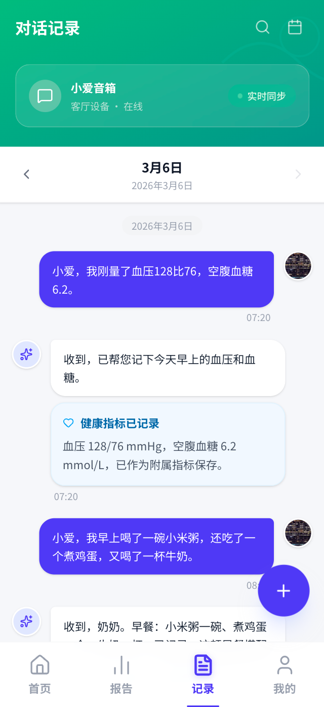 | 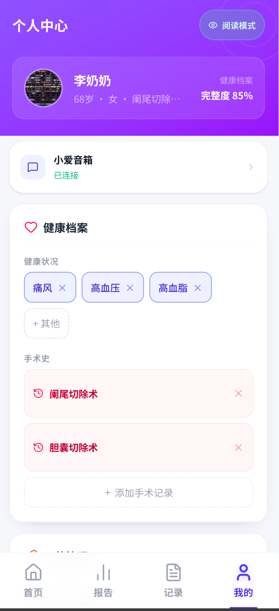 |
| 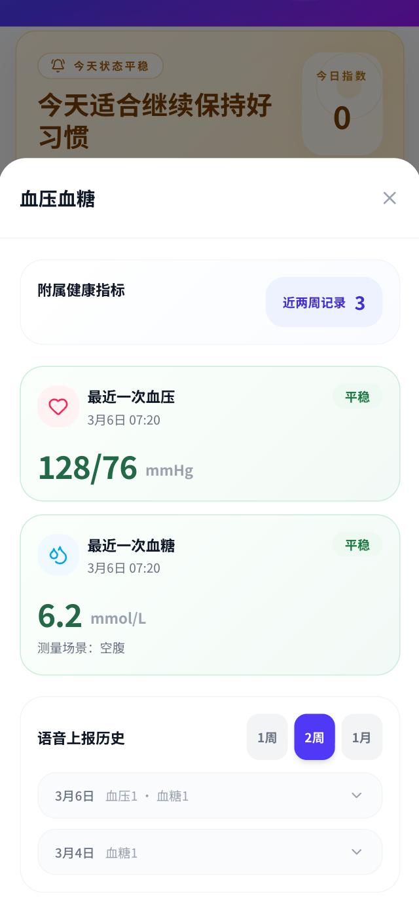 | 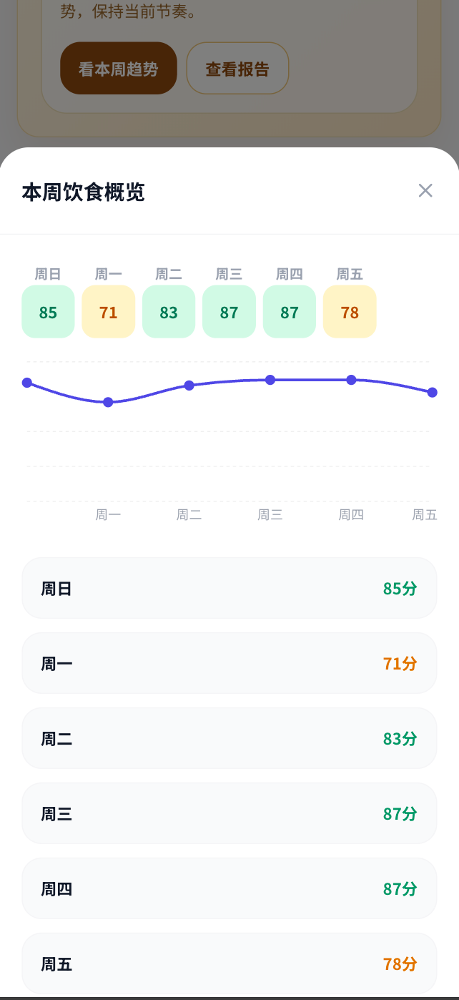 |
| 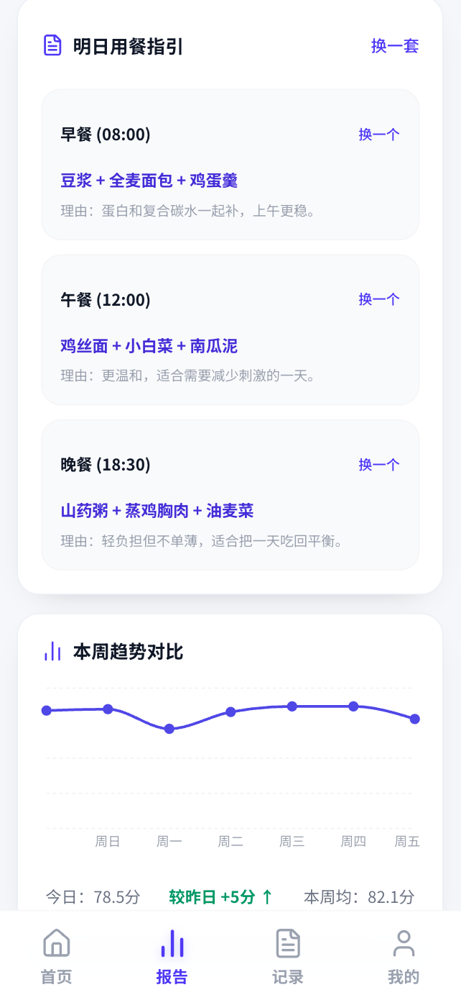 | 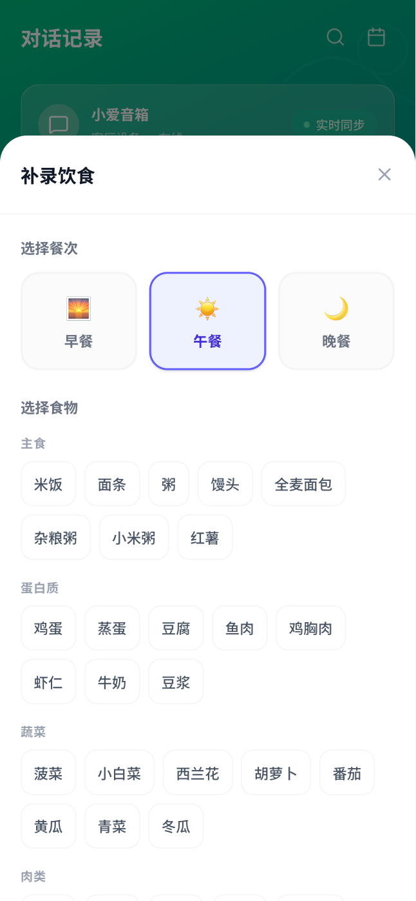 |
| 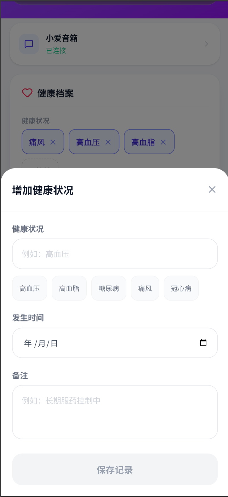 | 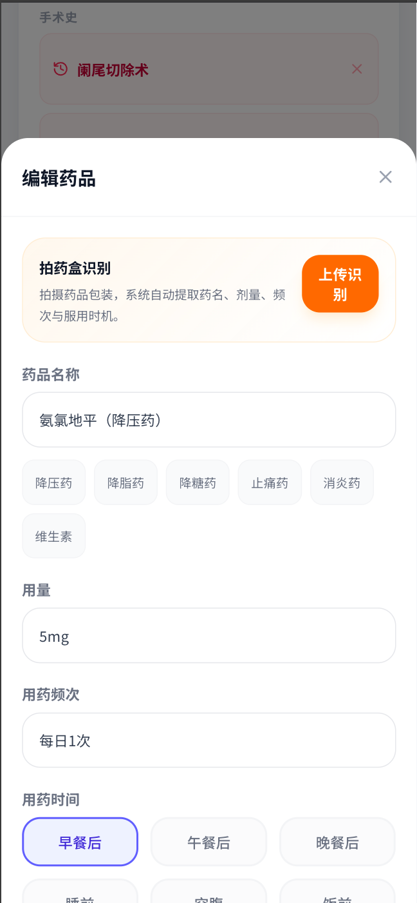 |
| 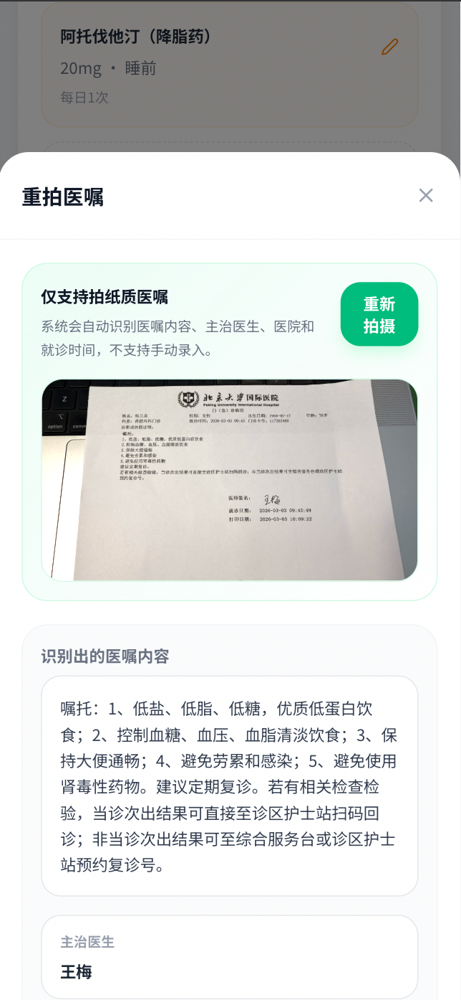 | 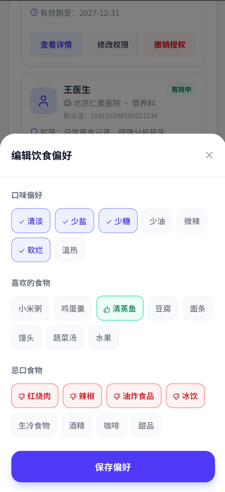 |

---

## 五、 做完后的感想

1. **AI真的能帮大忙**  
   以前觉得AI就是用来聊天或者写作业作弊的（哈哈），但这次看到它真的能看懂医生那复杂的字，还能帮爸爸妈妈规划做饭，我觉得科技真的很温暖。

2. **解决问题比写代码重要**  
   爸爸告诉我， AI 时代的到来代码已经不需要程序员来写了，这叫做 vibecoding。人来监督 AI 完成任务。最难的是发现奶奶真正的困难在哪里。比如我们一开始想做个APP，后来发现奶奶根本不会点APP，所以才改成了可以直接说话的形式。

3. **还要继续改进**  
   现在我们还要用手机操作，下一步我想让爸爸把这个功能直接连到家里的智能音箱上，这样奶奶连手机都不用拿，躺在床上喊一声就能记录了。

看着奶奶身体一天天好起来，爸爸做饭也不再皱着眉头，我觉得这个小发明特别有意义！

---

## 六、 谢谢爸爸

这个项目里的代码主要是爸爸在我的“指挥”下完成的（他说是“结对编程”），照片都是我在家里拍的真实生活照。

---
