# 让奶奶吃得对、记得住
## ——用“三餐管家”按医嘱帮奶奶管好一日三餐与健康记录

**说明：** 文中图片已链接至 `docs/md` 文件夹内对应文件（图1=IMG_1534.jpg，图2=IMG_1539.jpeg，图3=IMG_1540.jpeg，图4=IMG_1557.jpeg，图5=IMG_1562.jpeg，图6=IMG_1564.jpeg，图7=IMG_1565.jpeg，图8=IMG_1567.jpeg，图9=IMG_1568.jpeg，图10=IMG_1573.jpeg，图11=IMG_1560.jpeg，图12=IMG_1545.jpeg，图13=IMG_1548.jpeg，图14=IMG_1554.jpeg，图15=IMG_1555.jpeg，图16=IMG_1556.jpeg）。用 Markdown 阅读或导出为 PDF/Word 时图片会正常显示。

---

**作者：李思慧**  
**学校：** _____________（请填写）  
**组别：小学高年级组（五、六年级）**  
**辅导教师：** _____________（请填写）  
**结题时间：2025年12月**

---

## 一、摘要

我的奶奶去年做了手术，现在在家休养，需要长期吃药，还要按照医生说的注意饮食。我和家人在生活中发现：奶奶每天要吃很多种药，药名我们看都看不懂；医生嘱咐要少盐少糖、该吃什么不该吃什么，但家里做饭时很难天天照着做；奶奶要是能简单说一句“小爱，我早上吃了什么什么”，有人帮忙记下来、还能按医生的话给出建议就好了。于是我想，能不能做一个小系统：奶奶用语音告诉“小爱”吃了什么、量了血压血糖，系统自动记下来；家属用手机拍一下医生的纸质医嘱和药盒，系统自动识别，再根据这些帮奶奶规划一日三餐。在家长的帮助下，我用大约三周时间从零开始做出了“三餐管家”的雏形。这个报告先写我发现了什么问题、是怎么想的，再写我们是怎么做的，以及我的收获。报告里用到的照片都是我在家里拍的，每张下面会配一句话说明。

---

## 二、我发现了什么问题

奶奶手术后要长期吃药、按医生说的吃饭，我和家人在日常中遇到了很多小麻烦，我就用照片记了下来。

**（图1）**  
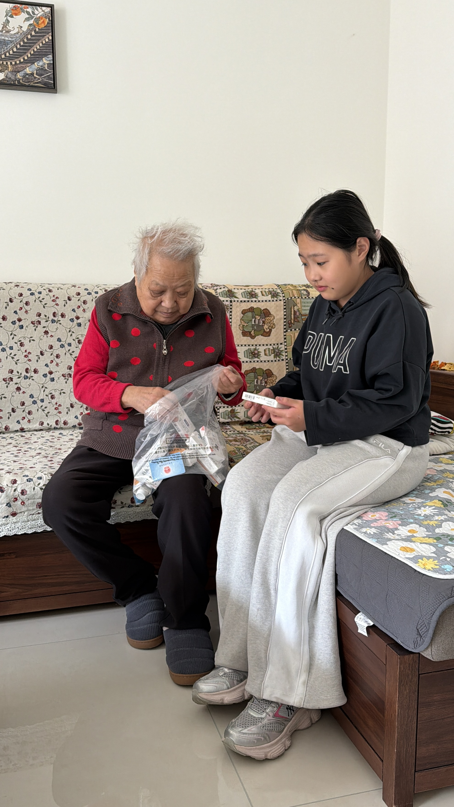  
**图1说明：** 奶奶给我看她每天要吃的药，药名和说明我像看天书一样，完全看不懂。

奶奶每天要吃的药有很多种，装在一个大袋子里。她一样一样拿出来给我看的时候，我发现药盒上的字很多都不认识，也不知道哪种是早上吃、哪种是晚上吃。奶奶自己也要看很久才分得清，有时候还会担心记错。

**（图2）**  
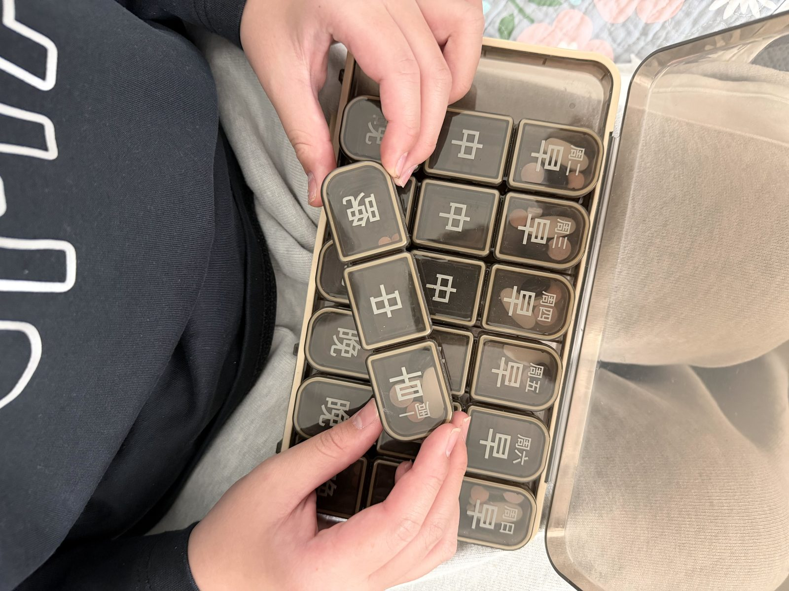  
**图2说明：** 奶奶用早、中、晚分格的药盒，是为了提醒自己别忘吃药。

为了不忘吃药，家里给奶奶买了分格药盒，上面写着“早”“中”“晚”和“周一”到“周日”。这样奶奶可以提前把一周的药分好，到点就开对应的小格子吃。但我发现，光靠药盒只能提醒“该吃了”，没法提醒“这顿饭菜是不是符合医生说的”。

**（图3）**  
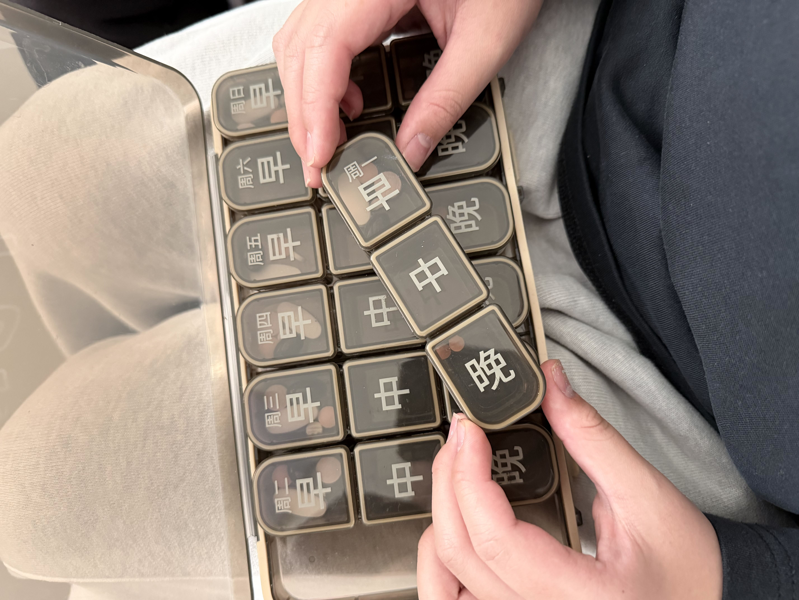  
**图3说明：** 按早中晚分列的周用药盒，家里人帮奶奶把一周的药都分好了。

药盒是按早、中、晚和时间分好的，家里人每个周末会帮奶奶把下一周的药装进去。这说明大家都很在意奶奶按时吃药，但医生还说了要“注意饮食”——吃什么、吃多少、少盐少糖，这些单靠药盒就没办法了。

**（图4）**  
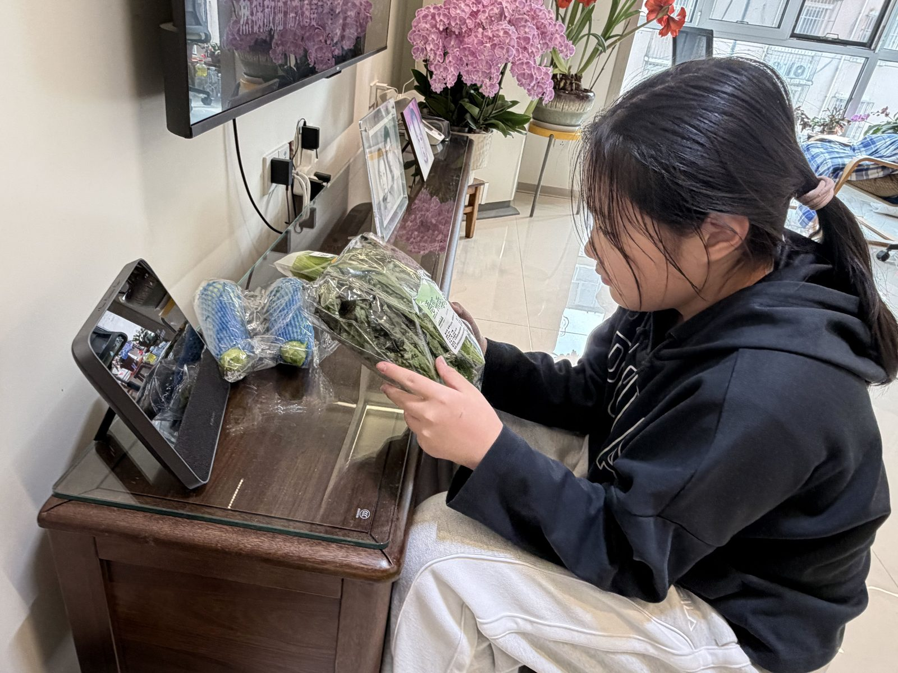  
**图4说明：** 我盯着蔬菜包装上的营养成分表看，在想：奶奶每天吃的菜，到底够不够营养、和医生说的对不对得上。

有时候我会看买回来的菜，包装上有营养成分表，但我看不太懂，也不知道奶奶一天该吃多少蔬菜、多少盐和糖。医生说的“少盐少糖”“多吃蔬菜”，到了每天做饭的时候，很难一点点对照。

**（图5）**  
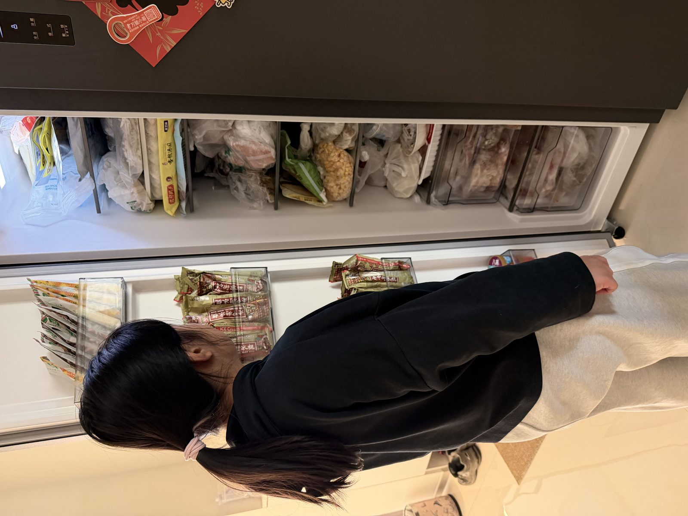  
**图5说明：** 冰箱里有猪肉、牛肉、鱼虾，我在想：这些奶奶都能吃吗？该怎么吃、吃多少？能不能按医生说的帮奶奶规划好？

打开冰箱，里面有各种肉和菜。医生说过奶奶要少吃某些肉、多吃某些菜，但具体到“今天中午吃什么肉、晚上吃什么”，家里人经常拿不准。我就想：要是有一个“小帮手”，能根据医生的话帮我们规划每天的三餐就好了。

**（图6）**  
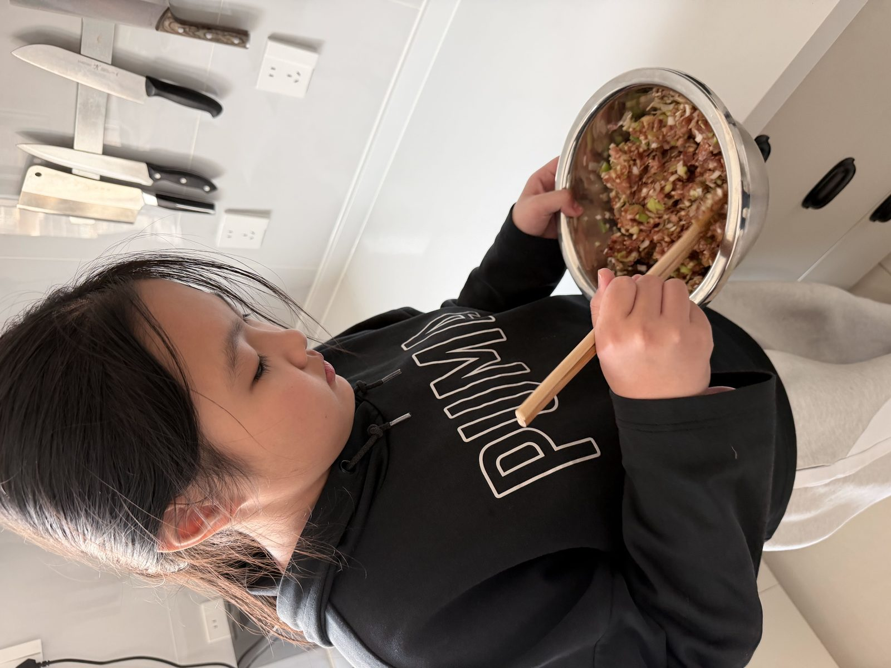  
**图6说明：** 今晚吃猪肉大葱馅饺子，我在想：这种馅和医生给的饮食建议一致吗？小爱能不能知道？

比如有一天家里包饺子，是猪肉大葱馅的。我就想：医生有没有说奶奶要少吃猪肉、或者少吃某种馅？当时没办法马上查，就觉得要是有一个系统，把医生的话录进去，每次做饭前能问一句“这样吃行不行”就好了。

**（图7）**  
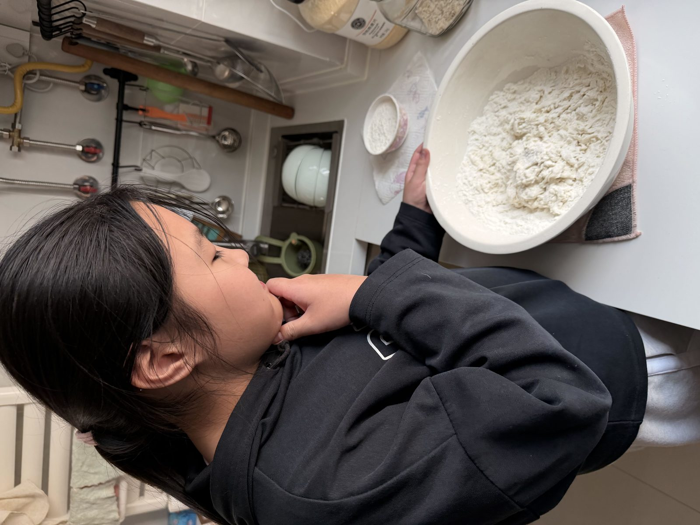  
**图7说明：** 吃面条、烙饼可以吗？该中午吃还是晚上吃？我想，AI能不能帮奶奶规划这些？

还有像面条、烙饼这些主食，奶奶能不能吃、该放在中午还是晚上、和药有没有冲突，我们也不太确定。我就想：要是电脑或AI能根据医生的话帮奶奶规划一下就好了。

**（图8）**  
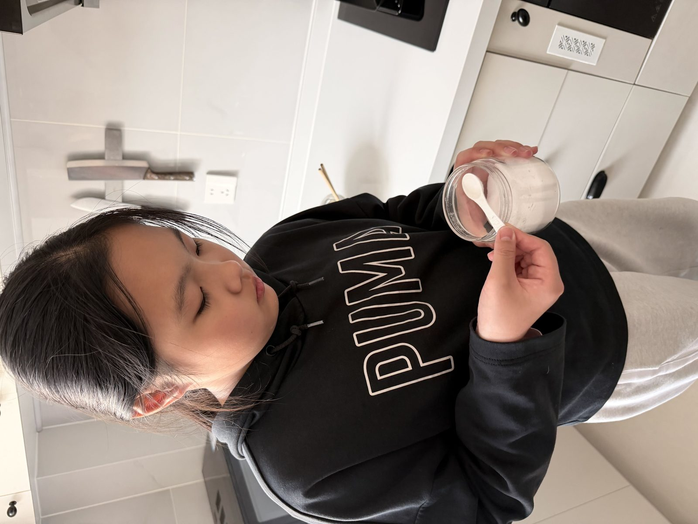  
**图8说明：** 医生要求少盐少糖，但做饭的时候怎么提醒奶奶和家里人注意呢？

医生特别说过要“少盐少糖”，可是炒菜的时候很容易手一抖就多放了。怎么在做饭的时候提醒大家注意，我们当时也没什么好办法。

**（图9）**  
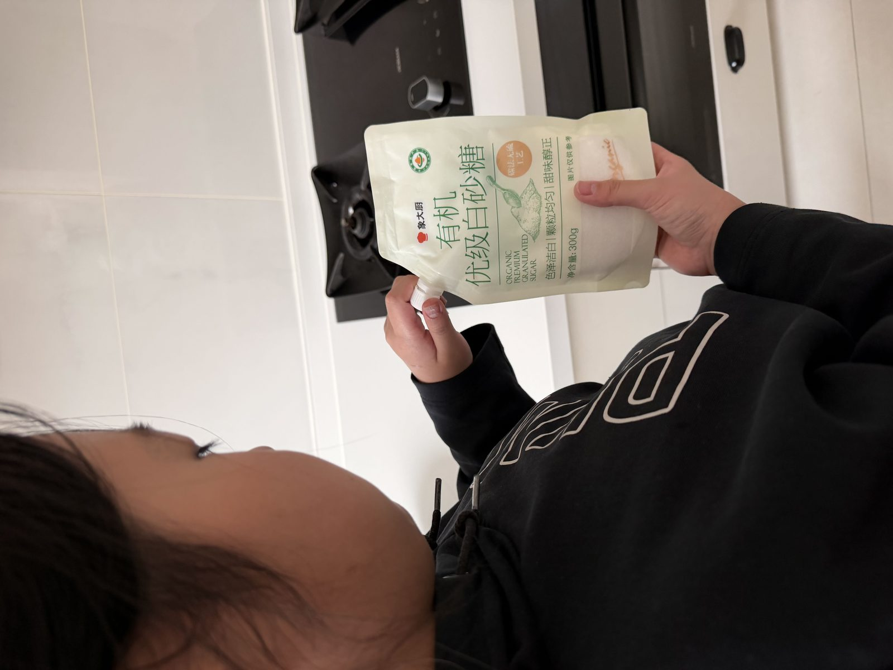  
**图9说明：** 少盐少糖是医嘱，怎么在日常生活里一直记得住、做得到？

平时泡茶、做饭，都会用到糖和盐。怎么让“少盐少糖”不只是看病那天记得，而是每天都能做到，这也是我想到的一个问题。

**（图10）**  
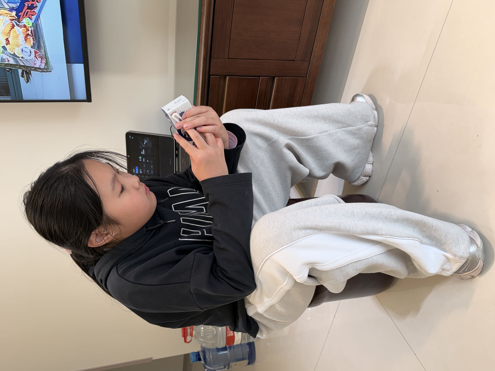  
**图10说明：** 牛奶奶奶能喝吗？喝多少？什么时候喝比较好？

还有像牛奶这种，奶奶能不能喝、一天喝多少、早上喝还是晚上喝，我们也会嘀咕。这些问题看起来小，但每天都会碰到，我就想：要是有一个地方能把医生说的都记下来，还能自动回答“这个能不能吃、吃多少”，就好了。

---

## 三、我是怎么想的

有了上面这些问题，我就开始想：能不能用家里的智能音箱和手机，帮奶奶解决一部分？

**（图11）**  
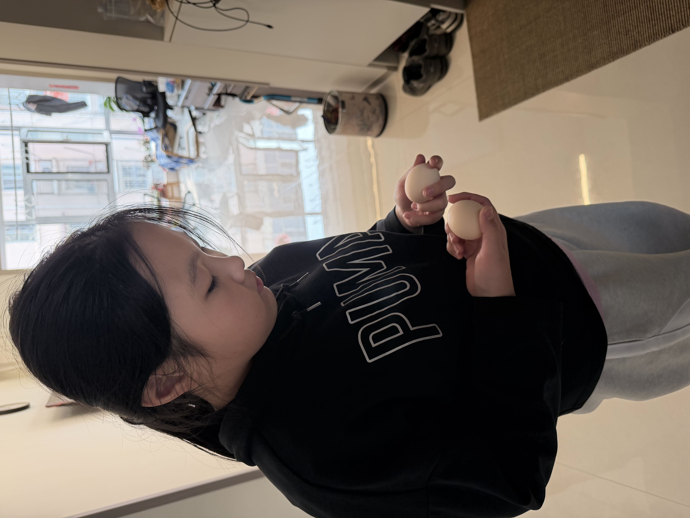  
**图11说明：** 我在想：鸡蛋奶奶能吃吗？煮着吃还是煎着吃？吃几个？什么时候吃？小爱同学能知道这些吗？

比如鸡蛋，奶奶能不能吃、怎么吃更好，我就想：要是小爱同学能“知道”奶奶的饮食要求，我们问它“鸡蛋能吃吗、吃几个”，它就能根据医生的话回答，该多好。

**（图12）**  
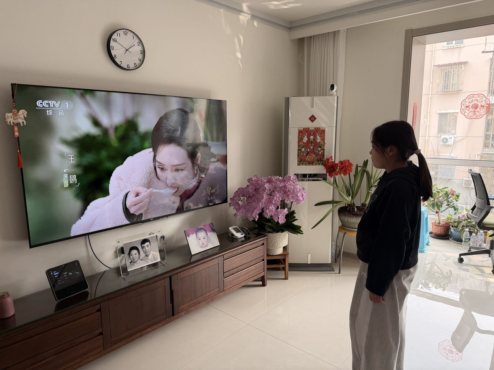  
**图12说明：** 我看着家里的小爱同学，想：有没有办法让它帮奶奶解决吃药提醒、健康管理和一日三餐规划这些问题？

家里本来就有小爱音箱，奶奶平时用它开电视、关电视。我就想：小爱这么聪明，能不能也帮奶奶记一下每天吃了什么、量了血压没有，再根据医生的话提醒我们“今天该少盐”“这顿可以多吃点菜”？

**（图13）**  
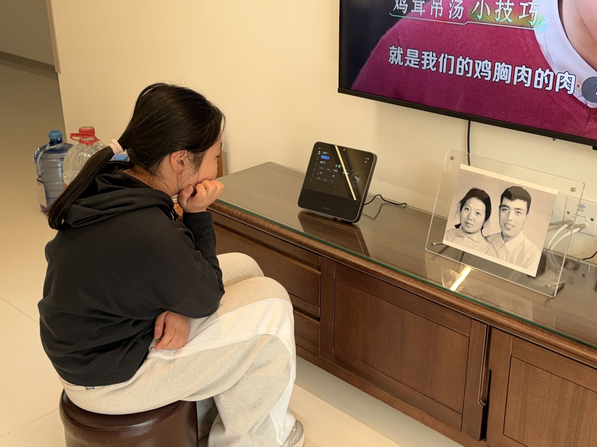  
**图13说明：** 我看着小爱音箱想：现在AI这么厉害，能不能让它帮奶奶规划每天的一日三餐和吃药情况？

电视上经常看到AI能帮人做很多事，我就想：我们能不能也做一个“小系统”，让奶奶用说话的方式告诉小爱“我早上吃了稀饭和鸡蛋”“我刚量了血压 128、76”，小爱就帮我们记下来，再根据医生的话帮奶奶规划后面该吃什么？

**（图14）**  
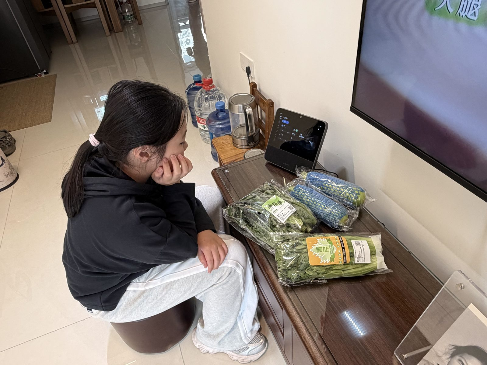  
**图14说明：** 奶奶去医院，医生会交代回家要注意饮食，比如该吃哪些食物、少盐少糖等。我就想：能不能让小爱根据这些医嘱帮奶奶规划一日三餐？

奶奶每次去医院，医生都会在病历或单子上写：注意饮食、少盐少糖、多吃什么少吃什么。我就想：要是把这些话拍下来存进系统，小爱能不能根据这些自动帮奶奶规划每天的三餐内容？

**（图15）**  
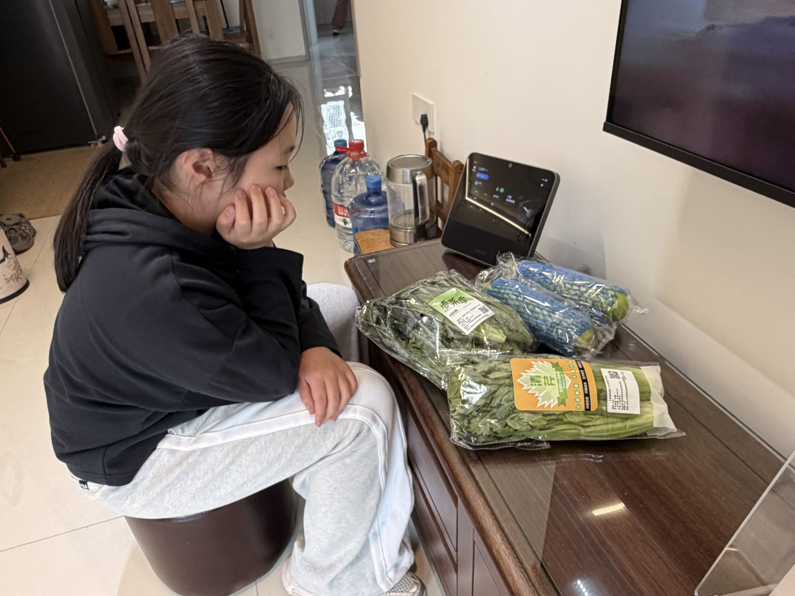  
**图15说明：** 医生开的医嘱里会有饮食建议，我想让小爱根据这些建议帮奶奶规划每天吃什么。

医生给的纸上字很多，家里人有时候会忘掉某一条。我就想：如果用手机把医嘱拍下来，系统能自动认出上面的字、把“少盐少糖”“多吃蔬菜”这些都记下来，再用来规划三餐，就不会漏掉了。

**（图16）**  
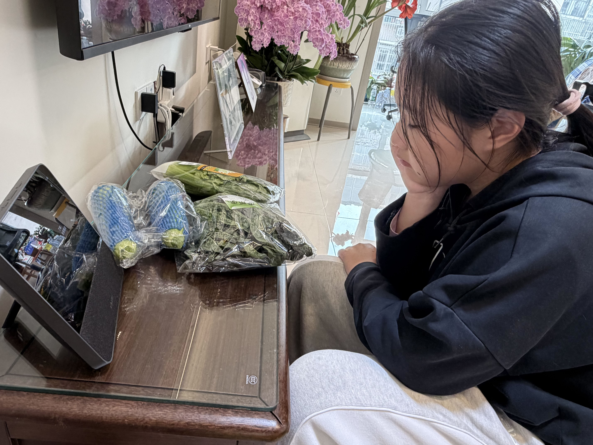  
**图16说明：** 我希望系统能根据医院给的医嘱，帮奶奶把每天的一日三餐都规划好。

把这些想法合在一起，我就想做一个东西：  
- 奶奶用语音跟小爱说“我早上吃了什么”“我量了血压多少”，系统就自动记下来；  
- 家属用手机拍医生的纸质医嘱和奶奶吃的药，系统自动识别，不用手打；  
- 系统根据医嘱和记录，帮奶奶规划一日三餐（比如少盐少糖、该吃什么菜和肉），还能记血压、血糖。  

这样，奶奶不用每天盯着手机，我们也能更放心。

---

## 四、我们是怎么做的（解决方案）

在家长的帮助下，我用了大约三周时间，从零开始做出了“三餐管家”的雏形。下面简单说我们做了哪些事，对应前面发现的问题和想法。

**1. 奶奶用语音，系统自动记“吃了什么”和“血压、血糖”**

我们做的系统已经能够从语音里自动识别：  
- 奶奶今天早中晚各吃了什么（比如“小爱，我早上吃了稀饭和鸡蛋”）；  
- 奶奶量的血压、血糖（比如“小爱，我量了血压 128 比 76，空腹血糖 6.2”）。  

奶奶第一次用的时候，先通过语音提交一些基本信息，之后就不用每天盯着手机了。系统里的程序会自动从她说的话里提取“吃了什么”“血压多少”“血糖多少”，保存下来，并用来做后面的分析和推荐。

**2. 根据医嘱和记录，自动分析和规划三餐**

系统里有一个“大脑”（程序）：它会根据已经保存的医嘱（少盐少糖、该吃什么不该吃什么）和奶奶每天报的饮食、血压血糖，自动做两件事：  
- 分析：今天这顿饭是不是符合医生说的；  
- 规划：推荐明天或后面几天可以吃什么、怎么搭配更合适。  

这样就不用我们每天自己对着医嘱一条条对了，系统会帮我们“记着”医生的话，并用到一日三餐的规划里。

**3. 家属用手机拍照，自动识别医嘱和药品**

我们实现了两个“拍照识别”功能：  
- **拍纸质医嘱**：家属用手机拍一下医生写的病历或饮食建议，系统会自动认出上面的字（比如“少盐少糖”“低脂饮食”），保存下来，不用再一条条打字。  
- **拍药盒**：奶奶每天吃的药，家属拍一下药盒，系统也能自动识别药名和用法，存进“用药记录”里，方便以后和饮食、血压血糖一起看。  

这样，医生说的话和奶奶吃的药，都能方便地进到系统里，用来做三餐规划和健康记录。

**4. 谁用什么**

- **奶奶**：主要用语音跟小爱说“我吃了什么”“我量了血压/血糖”，小爱负责记下来（目前我们先做了手机和网页上的记录与规划，小爱和系统的连接以后会再做）。  
- **家属（比如我爸爸、妈妈）**：用手机打开“三餐管家”，给奶奶录入或更新医嘱、正在吃的药；也能看到奶奶的饮食记录、血压血糖和系统给出的三餐建议。  
- **医生**：以后医生也可以在经过奶奶和家里人同意后，远程看到奶奶的吃饭和健康情况，方便随诊。这一点我们在报告里只简单提一下，不做重点。

我们做的重点，就是：**一日三餐能按医嘱来规划（少盐少糖、该吃什么），奶奶用语音就能把吃饭和血压血糖记下来，家属用手机拍医嘱和药盒就能自动识别，不用手打。** 这样既解决了“看不懂药名”“记不住医嘱”的问题，也解决了“每天吃什么才符合医生说的”的问题。

---

## 五、我的收获和体会

通过这个项目，我有了不少收获：

1. **从生活里发现问题**  
   奶奶吃药、吃饭、量血压这些事，每天都在家里发生。我学会了观察：哪些事让大人发愁、哪些事容易忘，然后把这些变成“要解决的问题”。

2. **敢想敢试**  
   一开始我也不知道能不能做成，只是觉得“要是小爱能帮奶奶就好了”。在家长帮助下，我学会了把大想法拆成小步骤：先做能记饮食和血压血糖的，再做能识别医嘱和药盒的，一步一步来。

3. **技术是为生活服务的**  
   语音识别、拍照识别、自动规划，听起来很“高科技”，但我们的目标很简单：让奶奶吃得对、记得住，让家里人更放心。技术是用来解决真实问题的，不是为了炫技。

4. **还要继续做下去**  
   现在手机和网页端已经能实现：语音提取吃饭和血压血糖、拍照识医嘱和药品、按医嘱做三餐分析和规划。接下来我们还想把家里的小爱音箱和这个系统连起来，让奶奶直接对小爱说，小爱就帮我们记下来，那样会更方便。

这个项目从想法到做出雏形，大概用了三周，想法是我提出的，设计和实现是在家长辅导下一起完成的。我会继续完善它，真正帮到奶奶和更多像我们这样的家庭。

---

## 六、说明与致谢

- 报告中的照片均为作者在家中拍摄，用于说明问题发现与思考过程；每张照片下方已配简要说明。  
- 本项目为作者在辅导教师（家长）指导下独立完成选题、方案设计和报告撰写，研究过程真实，未抄袭他人成果。  
- 感谢家长在技术实现和文档整理上的辅导与支持。

---

**（报告完）**
