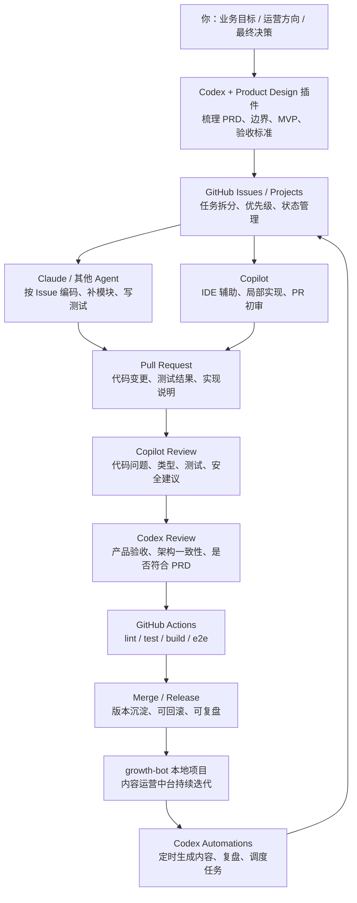

# Growth Bot 协作与交付规范

本文定义 `growth-bot` 的协作方式。后续 PRD、Issue、代码实现、Review 和发布都应遵循本规范。

## 目标

让 Codex、Product Design、GitHub、Claude、Copilot 和本地项目形成稳定协作链路：

- Codex 不承担所有具体编码，主要做指挥、架构、验收和调度。
- Product Design 负责把模糊想法整理成 PRD、边界和用户流程。
- GitHub 承担任务、PR、Review、CI、Release 和项目记忆。
- Claude / 其他 Agent 承担重编码执行。
- Copilot 承担 IDE 辅助、PR 初审和局部补测试。
- 本地 `growth-bot` 项目沉淀可运行代码、配置、内容资产和运营数据。

## 协作图



## 目录职责

当前有两个重要本地路径：

```text
/Users/liguang/Documents/xRunda/公司资料/2026/三餐管家
/Users/liguang/Documents/xRunda/project/AI/github/warmdiet-platform/growth-bot
```

职责划分：

| 路径 | 职责 |
| --- | --- |
| `公司资料/2026/三餐管家` | 私有业务资料、策划、PRD 备份、运营复盘、内部素材、不可公开资料 |
| `warmdiet-platform/growth-bot` | 可运行代码、公开文档、模板、平台适配器、可提交的内容流水线 |

## GitHub 工作流

每个开发单元必须进入 GitHub Issue，再进入 PR：

1. Codex / Product Design 产出 PRD 或功能说明。
2. Codex 将需求拆成 GitHub Issues。
3. Claude / 其他 Agent 按 Issue 开发。
4. 开发者或 Agent 提交 PR。
5. Copilot 做第一轮代码 Review。
6. Codex 做产品、架构、验收 Review。
7. CI 通过后合并。
8. 每周或每个可用里程碑发 Release。

## Issue 规范

每个 Issue 至少包含：

- 背景
- 范围
- 输入
- 输出
- 不做什么
- 验收标准
- 测试命令
- 预期交付文件

## Claude / Agent 任务包规范

给 Claude 或其他 Agent 的任务必须足够窄，推荐格式：

```text
任务：实现 growth-bot 的内容日历模块

背景：
这是三餐管家推广运营中台的一部分。

范围：
只实现 content calendar，不接真实平台 API。

输入：
data/trends/yyyy-mm-dd.json
config/project.json

输出：
content/calendar/yyyy-mm-dd.json

要求：
- TypeScript
- 本地文件存储
- 可重复运行
- 不覆盖人工编辑内容
- 包含单元测试

验收：
npm run test 通过
npm run daily:plan 能生成 10 条内容计划
```

## Codex 职责边界

Codex 优先做：

- PRD 澄清和产品边界判断
- 技术架构和模块拆分
- Issue 和验收标准编写
- Review 和合并前验收
- 内容策略判断
- 定时任务调度
- 风险和合规检查

Codex 尽量少做：

- 大量重复编码
- 长时间细碎修 bug
- 大批量平台手工发布
- 无明确验收标准的开放式实现

## 合规和安全边界

- 不购买 star，不互刷，不伪造互动。
- 不发布医疗诊断、治疗承诺或未经验证的疗效声明。
- 不使用真实患者数据。
- 不提交平台密钥、Cookie、Access Token。
- 国内平台优先半自动发布：自动填充，人工确认。
- X 可优先接官方 API 自动发布，但必须保留发布记录和失败重试。

